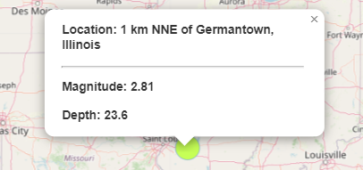
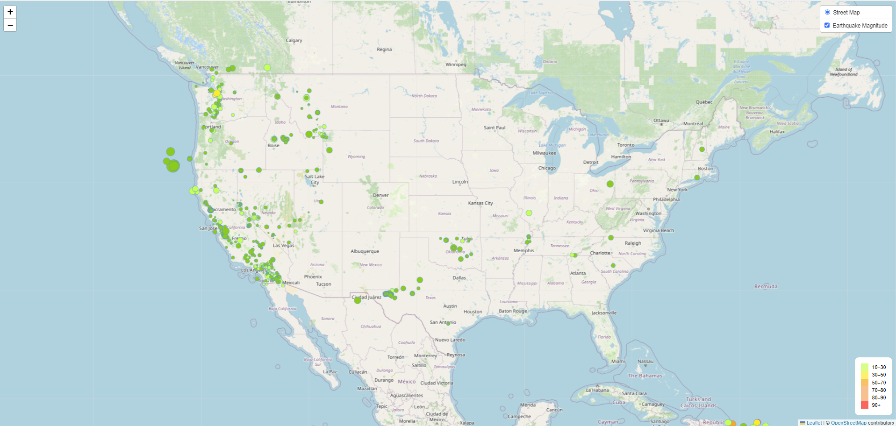

# $\color{purple}{\textsf{US Earthquake Magnitude and Depth Map}}$

## Description
The United States Geological Survey (USGS) collects a vast amount of daily data related to earthquakes.  However, they are in search of finding a way to display the collected data in a meaningful way, this map was developed to accomplish the task.

## Contents
In the outermost layer of the repository is the `index.html` file that is the structure for the webpage 
The [Starter_Code](Starter_Code) folder contains:
- An [Images](/Starter_Code/Images) folder that contains examples of output
- The [static](/Starter_Code/static) folder contains the `app.js` and `style.css` files for style and interactivity on the webpage 

## Visuals
### The image below displays the location, magnitude, and depth for each marker on the map

### The image below shows the dispersion of earthquakes across the US color-coded by depth and scaled by magnitude

## Installation
The tools used are: `Leaflet`, `Javascript`, `CSS`, `HTML`

## Usage
The map is zoomable.  You can click any marker on the map and a tooltip will display the respective earthquake data.

## Data Source
<a link href="https://earthquake.usgs.gov/earthquakes/feed/v1.0/summary/all_week.geojson">USGS JSON data</a>